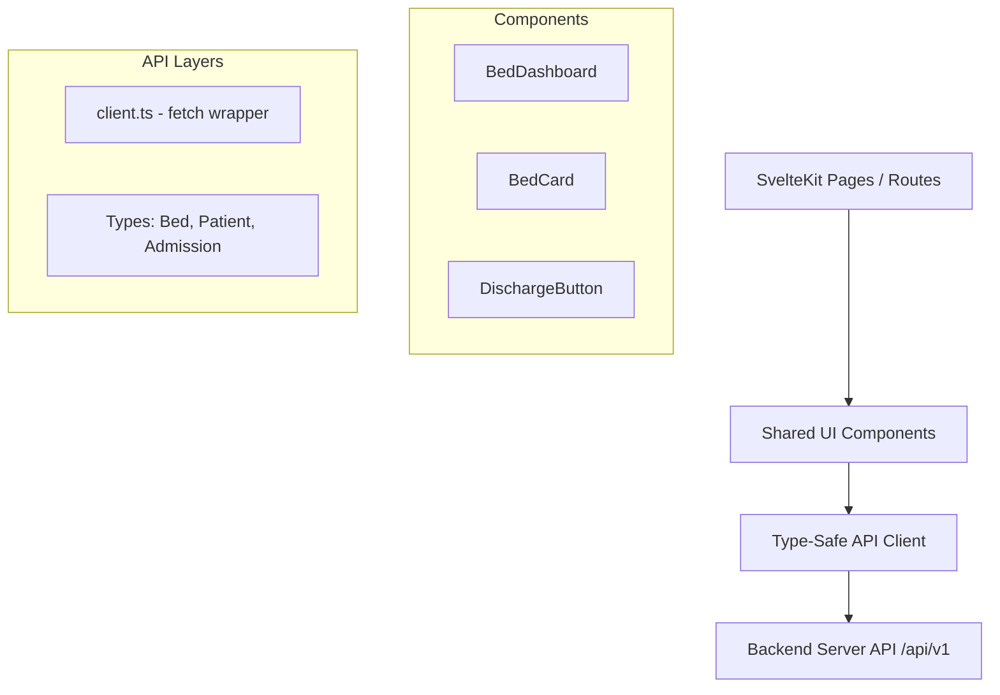

# 🏥 Hospital - Sistema de Gestión de Camas y Pacientes 🚀

Este proyecto es un cliente frontend moderno, interactivo y responsivo para un **Sistema de Gestión de Internación y Distribución de Camas Hospitalarias**, con un enfoque particular en áreas clínicas ginecológico-obstétricas. Permite visualizar la ocupación de camas en tiempo real, admitir e internar pacientes, registrar datos demográficos junto con sus antecedentes obstétricos específicos, y gestionar altas médicas de forma integrada.

Desarrollado con las tecnologías de vanguardia en el ecosistema web, este proyecto destaca por el uso avanzado del nuevo **Svelte 5 (Runas)**, **SvelteKit 2** y capacidades completas de **Progressive Web App (PWA)**.

---

## 🌟 Características Clave

### 1. 🗺️ Mapa de Camas en Tiempo Real (`BedDashboard`)
* **Visualización Dinámica**: Una cuadrícula interactiva que muestra de forma instantánea el estado de ocupación de las camas del hospital.
* **Estados Visuales Claros**: Código de colores HSL armonioso para diferenciar de inmediato camas **Disponibles** (Verde esmeralda 🟢) y camas **Ocupadas** (Rojo rubí 🔴).
* **Fácil Actualización**: Botón de refresco integrado para sincronizar el estado del pabellón directamente desde la API en segundos.

### 2. 🛏️ Tarjetas de Camas Inteligentes (`BedCard`)
* **Prefijos de Pabellón**: Soporte para identificar el tipo de cama y pabellón mediante prefijos definidos (ej. Maternidad, Quirófano, etc.).
* **Detalle Bajo Demanda**: Al hacer clic en una cama ocupada, se cargan de forma asíncrona los detalles del paciente internado (Nombre completo y DNI) sin recargar la página.
* **Acceso Directo a Acciones**: Integra flujos como la internación (si está libre) o el alta médica (si está ocupada).

### 3. 👥 Gestión Integral de Pacientes (`Patients Directory`)
* **Base de Datos Clínica**: Tabla interactiva con el listado de pacientes registrados en el sistema.
* **Búsqueda Avanzada**: Búsqueda en tiempo real por DNI o Nombre Completo.
* **Paginación del Servidor**: Navegación ágil y eficiente para grandes volúmenes de registros.
* **Historial Obstétrico Especializado**: Formulario modal para la creación y edición de pacientes, que permite ingresar antecedentes obstétricos críticos:
  * **G**estas (G)
  * **P**artos (P)
  * **C**esáreas (C)
  * **A**bortos (A)

### 4. 📝 Flujo de Internación Simplificado (`Admissions Wizard`)
* **Asistente Paso a Paso**: Formulario unificado para asignar rápidamente a un paciente en una de las camas actualmente disponibles en el establecimiento.
* **Integración Inteligente**: Permite la selección asistida extrayendo parámetros pre-cargados desde la URL (ej. si se hace clic en una cama específica o en el botón "Internar" de un paciente específico).

### 5. 🏥 Alta Médica con Doble Confirmación (`DischargeButton`)
* **Seguridad Clínica**: Previene altas accidentales mediante un componente interactivo de doble confirmación con advertencia de estado.
* **Liberación Inmediata**: Al completarse, la cama pasa a estar disponible automáticamente en el mapa general.

### 6. 📱 Compatibilidad PWA y Offline
* **Instalable**: Configurado mediante Vite PWA para instalarse como aplicación nativa en dispositivos móviles y de escritorio.
* **Sincronización Silenciosa**: Estrategia de actualización automática (`autoUpdate`) y service worker integrado para un comportamiento óptimo.

---

## 🛠️ Stack Tecnológico

El frontend está construido sobre un stack de última generación para garantizar la máxima velocidad, interactividad y mantenibilidad:

* **Framework Base**: [SvelteKit 2](https://kit.svelte.dev/) - Framework meta-directorio para enrutamiento basado en archivos, renderizado ágil y estados reactivos compartidos.
* **Motor Reactivo**: [Svelte 5](https://svelte.dev/) - La revolución de la reactividad basada en **Runas**.
* **Lenguaje**: [TypeScript](https://www.typescriptlang.org/) - Tipado estático completo para modelos clínicos e interfaces de API.
* **Herramienta de Construcción**: [Vite 6](https://vitejs.dev/) - Compilación ultrarrápida y Hot Module Replacement (HMR).
* **Integración PWA**: [@vite-pwa/sveltekit](https://vite-pwa-org.netlify.app/frameworks/sveltekit.html) - Soporte PWA nativo y automatizado para SvelteKit.
* **Estilos**: **Vanilla CSS Premium** - Diseños limpios, tipografías modernas (Inter/System sans-serif), bordes redondeados pulidos, gradientes fluidos y micro-animaciones en botones e interacciones hover.

### ⚡ Uso Avanzado de Runas (Svelte 5)
Este proyecto aprovecha al máximo el sistema reactivo moderno de Svelte 5:
* **`$state`**: Controla el estado local mutable de listas de camas, pacientes, estados de carga de formularios y aperturas de modales.
* **`$derived`**: Calcula de forma óptima variables dependientes como la ocupación de una cama (`isOccupied`), su color de estado (`statusColor`) o el texto representativo (`statusText`).
* **`$props`**: Recibe propiedades de componentes superiores de forma limpia y tipada (ej. `let { bed, onclick } = $props()`).
* **`$effect`**: Gestiona efectos secundarios de manera predecible, tales como sincronizar parámetros URL con el formulario de admisión o cargar la lista inicial de camas al montar el componente.
* **Component Snippets**: Uso de `{@render children()}` en el `+layout.svelte` principal para inyectar las diferentes páginas de forma nativa.

---

## 🏛️ Arquitectura del Cliente

El proyecto sigue una estructura limpia y desacoplada basada en responsabilidades claras:



* **Capa de Vistas (`routes/`)**: Encargada de renderizar la página de inicio, pacientes y flujos de internación. Captura y lee los parámetros de la URL.
* **Capa de Componentes (`lib/components/`)**: Piezas visuales reutilizables y autocontenidas que encapsulan lógica interactiva (ej. el estado de confirmación de un botón de alta o la carga diferida del paciente dentro de una cama).
* **Capa de API (`lib/api/`)**: Abstracción completa de las comunicaciones HTTP mediante Fetch API, proporcionando tipado estático riguroso para la API REST del backend.

---

## 📁 Estructura del Proyecto

A continuación se detalla la función de los directorios y archivos más significativos:

| Ruta | Propósito / Rol Funcional |
| :--- | :--- |
| `src/lib/api/` | Contiene el cliente de red. |
| `src/lib/api/client.ts` | Abstracción de llamadas fetch a `/api/v1` con tipos TypeScript (`Bed`, `Patient`, `Admission`). |
| `src/lib/components/` | Componentes UI interactivos de la aplicación. |
| `src/lib/components/BedDashboard.svelte` | Panel principal que organiza y renderiza el mapa de camas. |
| `src/lib/components/BedCard.svelte` | Tarjeta interactiva para representar cada cama individual. |
| `src/lib/components/DischargeButton.svelte` | Botón interactivo seguro con flujo de doble confirmación para altas. |
| `src/routes/` | Enrutamiento basado en archivos de SvelteKit. |
| `src/routes/+layout.svelte` | Plantilla principal global con barra de navegación adhesiva y estilos globales. |
| `src/routes/+page.svelte` | Página de inicio del sistema (muestra el mapa de camas). |
| `src/routes/patients/` | Directorio para la administración de pacientes. |
| `src/routes/patients/+page.svelte` | Tabla de pacientes con buscador, paginado del servidor y formulario de registro modal. |
| `src/routes/admissions/` | Directorio para el flujo de admisión. |
| `src/routes/admissions/new/+page.svelte` | Formulario de internación con selección interactiva de camas y pacientes. |
| `static/` | Recursos estáticos públicos (manifest de PWA, iconos, favicon). |
| `vite.config.ts` | Configuración de Vite con plugins para SvelteKit y PWA, y proxy de API. |
| `package.json` | Declaración de scripts de npm y dependencias del ecosistema. |

---

## 🚀 Comenzando

### Prerrequisitos
* **Node.js** (versión v18 o superior recomendada).
* **npm** (o administradores alternativos como yarn/pnpm).
* **Backend de Gestión Hospitalaria**: El servidor backend debe estar ejecutándose para responder a las solicitudes de la API.

### Instalación

1. **Clonar el repositorio** (o acceder a la carpeta del proyecto):
   ```bash
   git clone <url-del-repositorio>
   cd frontend
   ```

2. **Instalar dependencias**:
   ```bash
   npm install
   ```

### Configuración del Proxy de API
Para evitar problemas de CORS y simplificar la conectividad en desarrollo local, Vite está configurado con un proxy en `vite.config.ts` que redirige las solicitudes `/api` al backend local:

```typescript
server: {
    proxy: {
        '/api': 'http://localhost:8080' // Dirección por defecto del servidor backend
    }
}
```

> [!NOTE]
> Si tu backend se ejecuta en un puerto o máquina diferente, edita la propiedad `'http://localhost:8080'` en [vite.config.ts](file:///home/adhemar/Projects/hospital_management/frontend/vite.config.ts) con la URL correspondiente.

### Ejecución de la Aplicación

#### Entorno de Desarrollo (con Hot Reload)
Inicia el servidor local de desarrollo de Vite:
```bash
npm run dev
```
Una vez iniciado, abre tu navegador en `http://localhost:5173`.

#### Validación de Tipos y Diagnósticos
Para correr diagnósticos y chequear la consistencia de tipos de TypeScript y Svelte:
```bash
npm run check
```

#### Compilación para Producción
Para construir el bundle optimizado y minificado de producción:
```bash
npm run build
```

#### Vista Previa de Producción
Para levantar localmente la aplicación construida para producción:
```bash
npm run preview
```

---

## 📄 Licencia

Este proyecto está bajo una Licencia Comercial Privada / Licencia Propietaria. Todos los derechos reservados.

---
*Desarrollado para el sistema de coordinación de hospitalización de alta eficiencia. 🏥✨*
